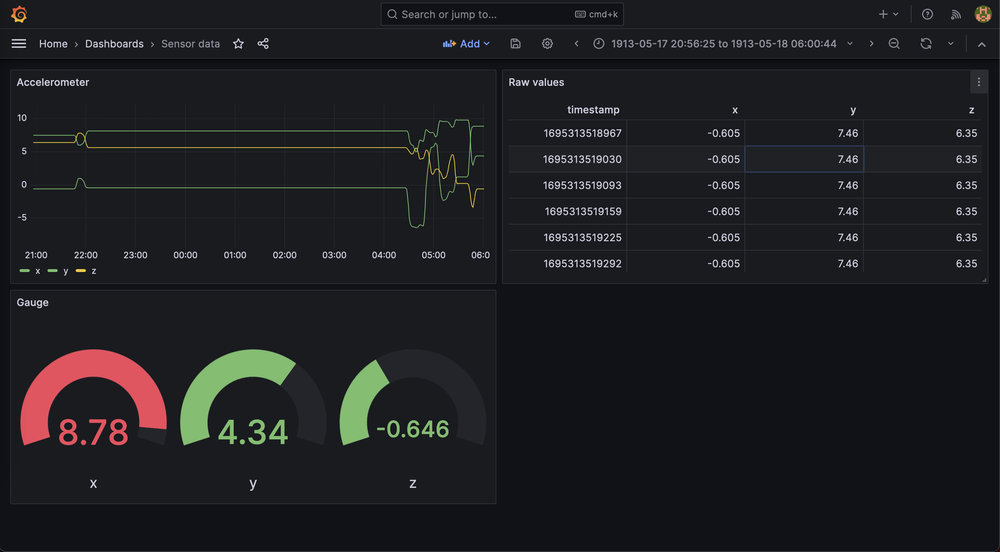
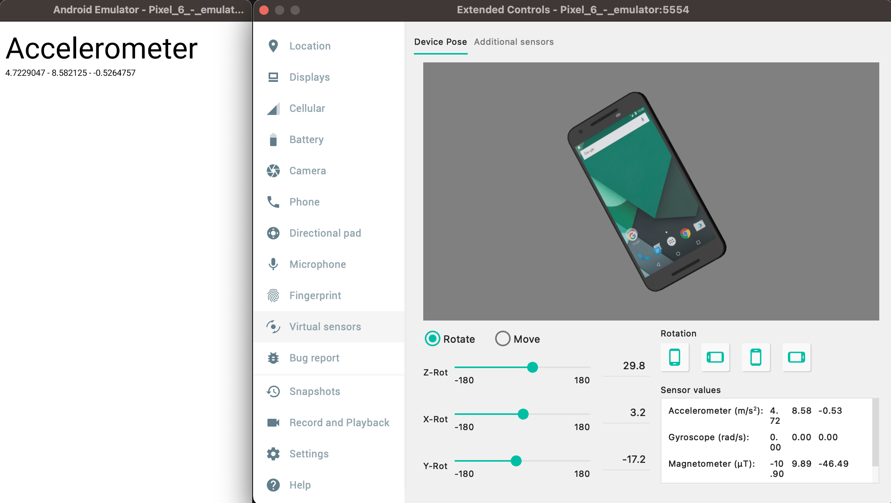

# Grafana and Android

This repo is a sample project meant to illustrate how to view Android device logs in a Grafana dashboard.

## How it works

The Android app does two things:
 - read values from sensors (accelerometer) and display them on screen
 - store these values in a SQLite database with Room

The database can then be exported and fed into Grafana.

## Grafana setup

There are only 3 steps to setup grafana :
 1. [Install it](https://grafana.com/docs/grafana/latest/setup-grafana/installation/) and run it
 2. Add the SQLite plugin (Administration > Plugins > Search for SQLite)
 3. Add a new SQLite datasource pointing to the database file

## Why though?

This is just an illustration project to show how Grafana can be used to analyse logs and sensor readings. There is probably a way to connect them in real time, but it's probably more involved.
